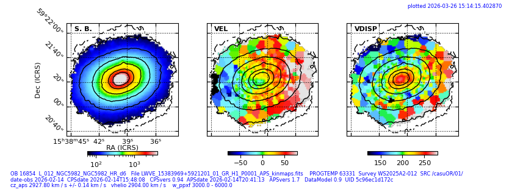
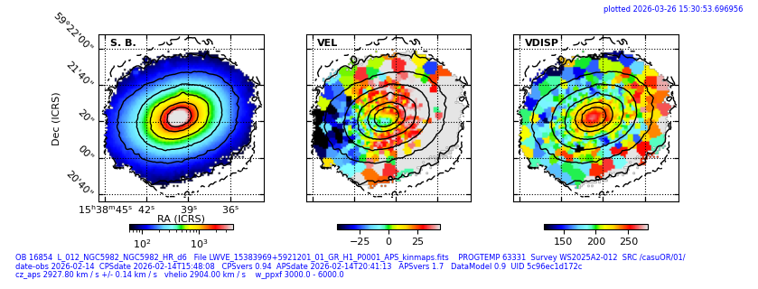
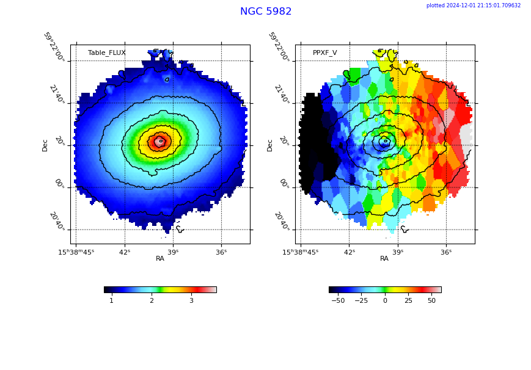
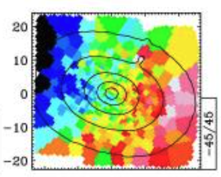

NGC 5982
========

Date 2026-03-26

## Inspect ngc5982 HR

   OBID 16854

   HR spectra 

   Directory: `/Volumes/Data3/wShells/wShellsCasuOR/ngc5982_hr_ob16854/01/L2`

   Date-obs 2026-02-14 cpsvers 0.94 apsvers 1.7

### mapsout

```bash
from wShells import wShells as ws
oblist=ws.do_many_mapsout(OBlist=['16854'])
```

### mapsrow

```bash
   oblist=ws.do_many_mapsrow(OBlist=['16854'], vel_heliocen=2904*u.km/u.s, savefig=\ **True**)
```






   Limits `vlim` set manually for now. Also for `sigma`. Code in

```bash
   kinem.mapsrow.Frame2D.choose_ylim()
```

   These plots correspond to data version `CasuOR - obdir - 01/L2/\*.png`


## Compare to sauron 2003


   FOV WEAVE = 90 arcsec , SAURON = 44 arcsec

   Vel map very similar in area of coincidence

   Sigma central ~275 in sauron, 266 in WEAVE HR. Good. 


|  WEAVE                                                |     SAURON    |
| ----------------------------------------------------- | ------------- |
|  ||


